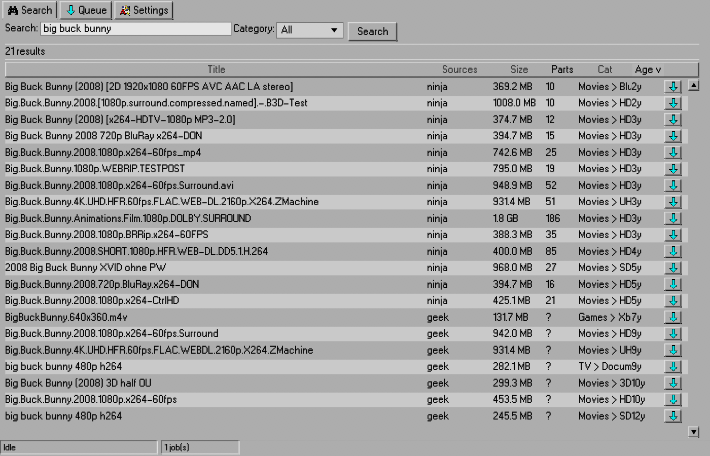
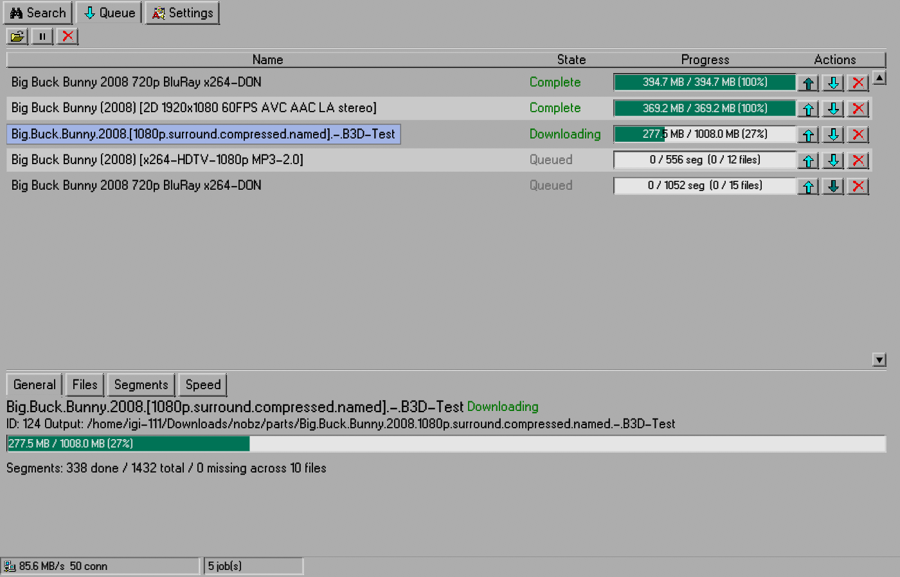

# TurboNBZ

A Usenet client that would have been right at home in 1995.

TurboNBZ is a native desktop Usenet downloader. Unified search across your
Newznab indexers on one side, a serious multi-connection download engine on the
other, all rendered in an interface that time-traveled forward from the
mid-nineties. Written in Rust, aiming for SABnzbd-parity download behavior,
and built NixOS-first.

## Screenshots

<p align="center">
  
</p>

<p align="center">
  
</p>

## Features

- **Unified indexer search**: one query across multiple Newznab indexers,
  merged and deduped, with the matching sources shown on each result.
- **NZB import**: add downloads from an `.nzb` file or a URL.
- **A real download engine**: multi-connection NNTP to one or more servers with
  per-server connection limits, server fallback on failed articles, and
  article-level resume (kill it mid-download and it picks up where it left off).
- **yEnc with verification**: pure-Rust decoding plus CRC32 checking; missing
  and corrupt segments are reported, not silently assembled.
- **Post-processing**: PAR2 verification (repair comes later), and unpacking
  of RAR and 7z archives, including password-protected ones (per-download
  passwords, remembered per job).
- **Live per-segment view**: every segment's state (downloaded, fetching,
  missing, bad CRC, failed) drawn as a color block map straight out of a
  defragmenter.
- **Err, on purpose**: files that fail are marked as failed with a readable
  reason; a bad server hostname is detected up front instead of after five
  minutes of retries.
- **The whole Windows 95 thing**: beveled everythings, embossed text,
  Chicago95 icons, custom scrollbars, no menu bar. You get the idea.

## Getting started

On Nix:

```sh
nix run
```

With Cargo (Rust 1.85+):

```sh
cargo run -p turbonbz-gui
```

The first-run wizard will walk you through adding an NNTP server and at least
one indexer, connection tests included.

## Configuration

Configuration, the queue database, and downloaded files live in your OS's
standard user directories, via the `directories` crate:

| What | Linux | Windows | macOS |
|------|-------|---------|-------|
| Settings | `~/.config/turbonbz/config.json` | `%APPDATA%\turbonbz\config.json` | `~/Library/Application Support/turbonbz/config.json` |
| Queue (SQLite) | `~/.local/share/turbonbz` | `%APPDATA%\turbonbz` | `~/Library/Application Support/turbonbz` |

Downloads default to your OS download folder.

## Development

```sh
cargo test --workspace
cargo clippy --workspace --all-targets -- -D warnings
cargo fmt --check
```

The end-to-end download tests want a live, reachable NNTP server to run
against; the rest are self-contained.
